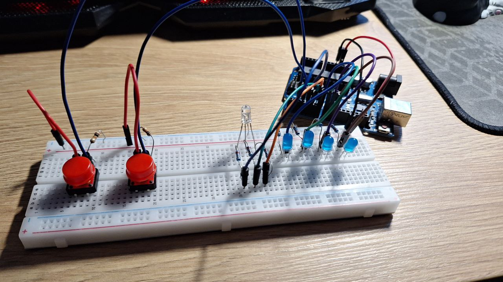
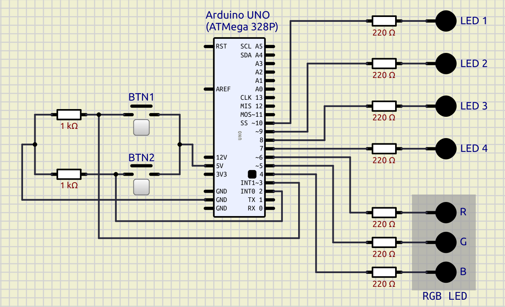

# EV Charging Station

This project is an Arduino-based (ATMega328P) controller for a "charging station", featuring LED indicators and buttons to control the charging process.

[Prject #2](https://github.com/Adrifot/TypeRacer-Arduino)

## Table of Contents

1. [Overview](#overview)
2. [Hardware Setup](#hardware-setup)
3. [Installation](#installation)
4. [Usage](#usage)

## Overview

The Charging Station uses two buttons to start and stop the charging process, while the blue LEDs and the RGB LED provides visual feedback. BTN1 initiates charging and BTN2 stops the process if long-pressed for at least 3 seconds. See [Project Schematic](#project-schematic) for more info.



## Hardware Setup

### Components
- Arduino UNO board
- x2 push buttons (BTN1, BTN2)
- x4 blue LEDs - for charge process simulation (LED1-4)
- x1 RGB LED - red/green color shows station availability (RLED, GLED)
- x6 220Ω resistors (for LEDs) - _optionally + 1 220Ω resistor for the blue pin in the RGB LED_.
- x2 1K resistors (for buttons)
- Jumper wires

### Connections
- BTN1 (Pin 3)
- BTN2 (Pin2)
- LED1 to LED4 (Pins 7 to 10)
- GLED (Pin 5)
- RLED (Pin 6)
- _Optional: BLED (Pin4) - in case you want to add/modify something_.

> [!NOTE]
Both buttons (BTN1 & BTN2) use **pull-down** resistors.

### Project Schematic



> [!NOTE]
In the [schematics](./assets/schematics/) folder you can find a .sim file that can be opened in [SimulIDE](https://simulide.com/p/).

## Installation
1. Clone the repository:
```bash
git clone https://github.com/Adrifot/Arduino-EV-Charger.git
```

2. Open the `main.cpp` file. You can convert it to a `.ino` file to open it in Arduino IDE. Otherwise, you can use the [PlatformIO extension for VSCode](https://platformio.org/install/ide?install=vscode).

3. Connect your Arduino board and upload the code. Open the serial monitor.

## Usage
1. Wait for the green LED to turn on and the "charging station available" message to appear on the monitor.

2. Press **BTN1** to start charging. The green LED will become RED and the blue LEDs will start blinking. 

3. Wait for the process to finish or press and hold **BTN2** for 3 seconds to forcefully stop the charging process.
